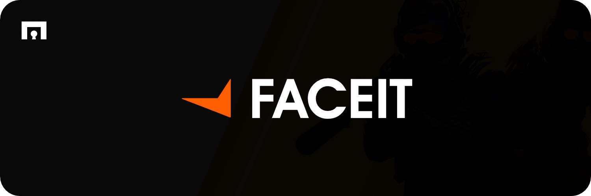

<div align="center">



[](https://github.com/muijf/faceit/actions)
[](https://crates.io/crates/faceit)
[](https://docs.rs/faceit)
[](https://github.com/muijf/faceit/blob/main/LICENSE)

**A Rust client library for the FACEIT Public API**

*Type-safe, async API client with comprehensive error handling, builder pattern configuration, and full Data API v4 support.*

[Documentation](https://docs.rs/faceit) • [Examples](examples/) • [Contributing](CONTRIBUTING.md) • [Code of Conduct](CODE_OF_CONDUCT.md)

</div>

---

**Key Features:** Builder pattern • Ergonomic APIs • Comprehensive error handling • Full async/await support • Automatic JSON deserialization • API key and access token support • Feature flags for customization • Full Data API v4 coverage

---

## Table of Contents

- [Installation](#installation)
- [Feature Flags](#feature-flags)
- [Quick Start](#quick-start)
- [API Methods](#api-methods)
- [Ergonomic APIs](#ergonomic-apis)
- [Error Handling](#error-handling)
- [Examples](#examples)
- [Development](#development)
- [License](#license)
- [Contributing](#contributing)

---

## Installation

Add this to your `Cargo.toml`:

```toml
[dependencies]
faceit = "0.1.1"
tokio = { version = "1", features = ["full"] }
```

> **Note**: This library requires an async runtime. Tokio is recommended, but any async runtime compatible with `reqwest` will work.

## Feature Flags

> Most features are optional to keep the core library lightweight. Enable only what you need.

**Core Features:**
- `default` - Enables all default features (`ergonomic`, `rustls-tls`)
- `ergonomic` - Enables ergonomic API wrappers for Player, Match, Game, Hub, and Championship
- `rustls-tls` - Uses `rustls` as the TLS backend for reqwest (default, recommended)
- `native-tls` - Uses `native-tls` as the TLS backend for reqwest

**Quick examples:**

```toml
# Default (includes ergonomic APIs and rustls)
faceit = "0.1.1"

# Minimal setup (without ergonomic APIs)
faceit = { version = "0.1.1", default-features = false, features = ["rustls-tls"] }

# With native-tls instead of rustls
faceit = { version = "0.1.1", default-features = false, features = ["ergonomic", "native-tls"] }
```

## Quick Start

```rust
use faceit::HttpClient;

#[tokio::main]
async fn main() -> Result<(), faceit::error::Error> {
    // Create a client
    let client = HttpClient::new();

    // Get player by ID
    let player = client.get_player("player-id-here").await?;

    println!("Player: {}", player.nickname);
    if let Some(country) = player.country {
        println!("Country: {}", country);
    }

    Ok(())
}
```

**Output:**
```
Player: PlayerName
Country: GB
```

> For more examples and usage patterns, see the [examples](#examples).

## API Methods

### Player Methods

#### Get Player by ID

```rust
use faceit::HttpClient;

let client = HttpClient::new();
let player = client.get_player("player-id-here").await?;
```

#### Get Player from Lookup

```rust
use faceit::HttpClient;

let client = HttpClient::new();

// By nickname
let player = client.get_player_from_lookup(Some("player_nickname"), None, None).await?;

// By nickname and game
let player = client.get_player_from_lookup(Some("player_nickname"), Some("cs2"), None).await?;

// By game_player_id
let player = client.get_player_from_lookup(None, Some("cs2"), Some("game_player_id")).await?;
```

#### Get Player Stats

```rust
use faceit::HttpClient;

let client = HttpClient::new();
let stats = client.get_player_stats("player-id", "cs2").await?;
```

#### Get Player Match History

```rust
use faceit::HttpClient;

let client = HttpClient::new();
let history = client.get_player_history(
    "player-id",
    "cs2",
    None,  // from timestamp (optional)
    None,  // to timestamp (optional)
    Some(0),  // offset
    Some(20), // limit
).await?;
```

#### Get Player Bans

```rust
use faceit::HttpClient;

let client = HttpClient::new();
let bans = client.get_player_bans("player-id", Some(0), Some(20)).await?;
```

### Match Methods

#### Get Match Details

```rust
use faceit::HttpClient;

let client = HttpClient::new();
let match_details = client.get_match("match-id-here").await?;
```

#### Get Match Statistics

```rust
use faceit::HttpClient;

let client = HttpClient::new();
let stats = client.get_match_stats("match-id-here").await?;
```

### Game Methods

#### Get All Games

```rust
use faceit::HttpClient;

let client = HttpClient::new();
let games = client.get_all_games(Some(0), Some(20)).await?;
```

#### Get Game Details

```rust
use faceit::HttpClient;

let client = HttpClient::new();
let game = client.get_game("cs2").await?;
```

### Hub Methods

#### Get Hub Details

```rust
use faceit::HttpClient;

let client = HttpClient::new();
let hub = client.get_hub("hub-id", None).await?;

// With expanded entities
let hub = client.get_hub("hub-id", Some(&["organizer", "game"])).await?;
```

#### Get Hub Matches

```rust
use faceit::HttpClient;

let client = HttpClient::new();
let matches = client.get_hub_matches(
    "hub-id",
    Some("all"),  // type: "all", "upcoming", "ongoing", "past"
    Some(0),
    Some(20),
).await?;
```

### Championship Methods

#### Get Championships

```rust
use faceit::HttpClient;

let client = HttpClient::new();
let championships = client.get_championships(
    "cs2",
    Some("all"),  // type: "all", "upcoming", "ongoing", "past"
    Some(0),
    Some(10),
).await?;
```

#### Get Championship Details

```rust
use faceit::HttpClient;

let client = HttpClient::new();
let championship = client.get_championship("championship-id", None).await?;
```

### Search Methods

#### Search Players

```rust
use faceit::HttpClient;

let client = HttpClient::new();
let results = client.search_players(
    "player_nickname",
    Some("cs2"),  // game filter (optional)
    None,         // country filter (optional)
    Some(0),
    Some(20),
).await?;
```

#### Search Teams

```rust
use faceit::HttpClient;

let client = HttpClient::new();
let results = client.search_teams(
    "team_nickname",
    Some("cs2"),  // game filter (optional)
    Some(0),
    Some(20),
).await?;
```

#### Search Hubs

```rust
use faceit::HttpClient;

let client = HttpClient::new();
let results = client.search_hubs(
    "hub_name",
    Some("cs2"),  // game filter (optional)
    Some("EU"),   // region filter (optional)
    Some(0),
    Some(20),
).await?;
```

### Ranking Methods

#### Get Global Ranking

```rust
use faceit::HttpClient;

let client = HttpClient::new();
let ranking = client.get_global_ranking(
    "cs2",
    "EU",         // region (required)
    None,         // country filter (optional)
    Some(0),
    Some(20),
).await?;
```

#### Get Player Ranking

```rust
use faceit::HttpClient;

let client = HttpClient::new();
let ranking = client.get_player_ranking(
    "cs2",
    "EU",
    "player-id",
    None,         // country filter (optional)
    Some(20),
).await?;
```

### Using Authentication

FACEIT Data API supports two types of authentication:

1. **API Key** - Server-side or client-side API keys obtained from the [FACEIT Developer Portal](https://developers.faceit.com/)
2. **Access Token** - User access tokens obtained via OAuth2

Both are passed using the `Authorization: Bearer {token}` header format. Authentication provides higher rate limits.

```rust
use faceit::HttpClient;

// Using an API key
let client = HttpClient::builder()
    .api_key("your-api-key")
    .build()?;

// Using an access token
let client = HttpClient::builder()
    .api_key("your-access-token")
    .build()?;
```

### Builder Pattern

For advanced configuration:

```rust
use faceit::HttpClient;
use std::time::Duration;

let client = HttpClient::builder()
    .api_key("your-api-key")
    .timeout(Duration::from_secs(60))
    .base_url("https://custom-api.example.com")
    .build()?;
```

## Ergonomic APIs

> The ergonomic APIs provide a convenient way to work with resources without needing to pass IDs to each method call. Enable the `ergonomic` feature to use these APIs.

The ergonomic APIs wrap resources (Player, Match, Game, Hub, Championship) and store the ID, allowing you to call methods without passing it each time.

### Player API

```rust
use faceit::{HttpClient, http::ergonomic::Player};

let client = HttpClient::new();
let player = Player::new("player-id-here", &client);

// No need to pass player ID each time
let player_data = player.get().await?;
let stats = player.stats("cs2").await?;
let history = player.history("cs2", None, None, Some(0), Some(20)).await?;
let bans = player.bans(Some(0), Some(20)).await?;
let hubs = player.hubs(Some(0), Some(50)).await?;
let teams = player.teams(Some(0), Some(20)).await?;
let tournaments = player.tournaments(Some(0), Some(20)).await?;
```

### Match API

```rust
use faceit::{HttpClient, http::ergonomic::Match};

let client = HttpClient::new();
let match_obj = Match::new("match-id-here", &client);

let match_data = match_obj.get().await?;
let stats = match_obj.stats().await?;
```

### Game API

```rust
use faceit::{HttpClient, http::ergonomic::Game};

let client = HttpClient::new();
let game = Game::new("cs2", &client);

let game_data = game.get().await?;
let parent = game.parent().await?;
let matchmakings = game.matchmakings(Some("EU"), Some(0), Some(20)).await?;
```

### Hub API

```rust
use faceit::{HttpClient, http::ergonomic::Hub};

let client = HttpClient::new();
let hub = Hub::new("hub-id-here", &client);

let hub_data = hub.get(None).await?;
let matches = hub.matches(Some("all"), Some(0), Some(20)).await?;
let members = hub.members(Some(0), Some(50)).await?;
let stats = hub.stats(Some(0), Some(20)).await?;
```

### Championship API

```rust
use faceit::{HttpClient, http::ergonomic::Championship};

let client = HttpClient::new();
let championship = Championship::new("championship-id-here", &client);

let championship_data = championship.get(None).await?;
let matches = championship.matches(Some("all"), Some(0), Some(20)).await?;
```

### Direct Instantiation

You can also create ergonomic API instances directly:

```rust
use faceit::{HttpClient, http::ergonomic::{Player, Match, Game, Hub, Championship}};

let client = HttpClient::new();

let player = Player::new("player-id-here", &client);
let match_obj = Match::new("match-id-here", &client);
let game = Game::new("cs2", &client);
let hub = Hub::new("hub-id-here", &client);
let championship = Championship::new("championship-id-here", &client);
```

## Error Handling

The library provides comprehensive error types:

```rust
use faceit::error::Error;

match result {
    Ok(data) => println!("Success: {:?}", data),
    Err(Error::MissingParameter(msg)) => eprintln!("Missing required parameter: {}", msg),
    Err(Error::InvalidApiKey) => eprintln!("Invalid API key or access token"),
    Err(Error::Http(e)) => eprintln!("HTTP error: {}", e),
    Err(Error::Api(status, msg)) => eprintln!("API error {}: {}", status, msg),
    Err(Error::ServerError) => eprintln!("Server error (500)"),
    Err(e) => eprintln!("Other error: {}", e),
}
```

FACEIT API error codes:
- `400` - Bad request
- `401` - Unauthorized (invalid API key or access token)
- `403` - Forbidden
- `404` - Not found
- `429` - Too many requests
- `500` - Server error
- `503` - Service temporarily unavailable

## Examples

> Run any example with: `cargo run --example <name>`

**Core Examples:**
- **[`basic_usage`](examples/basic_usage.rs)** - Basic API usage with all methods
- **[`ergonomic_api`](examples/ergonomic_api.rs)** - Ergonomic API usage (requires `ergonomic` feature)

### Basic Usage Example

```rust
use faceit::HttpClient;

#[tokio::main]
async fn main() -> Result<(), faceit::error::Error> {
    let client = HttpClient::new();

    // Get player
    let player = client.get_player("player-id-here").await?;
    println!("Player: {}", player.nickname);

    // Get player stats
    let stats = client.get_player_stats("player-id", "cs2").await?;

    // Get match details
    let match_details = client.get_match("match-id-here").await?;

    // Search for players
    let results = client.search_players("player_name", Some("cs2"), None, Some(0), Some(20)).await?;

    // Get global ranking
    let ranking = client.get_global_ranking("cs2", "EU", None, Some(0), Some(20)).await?;

    Ok(())
}
```

## Development

**Format code:**
```bash
cargo fmt --all
```
Formats all Rust code according to the official style guide.

**Lint code:**
```bash
cargo clippy --all-targets --all-features -- -D warnings
```
Runs Clippy linter with all targets and features enabled, treating warnings as errors.

**Run tests:**
```bash
cargo test --all-features
```
Runs all tests with all features enabled to ensure comprehensive coverage.

**Run doc tests:**
```bash
cargo test --doc
```
Runs documentation tests to ensure all code examples compile and work correctly.

> **Editor setup**: Recommended extensions are available in [`.vscode/extensions.json`](.vscode/extensions.json). See [CONTRIBUTING.md](CONTRIBUTING.md) for development guidelines and pre-commit hooks.

## Rate Limits

- **Without authentication**: Subject to standard rate limits
- **With API key or access token**: Higher rate limits (check [FACEIT documentation](https://developers.faceit.com/) for current limits)

For more information about authentication, see the [FACEIT Developer Documentation](https://developers.faceit.com/).

## License

This project is licensed under the MIT License - see the [LICENSE](LICENSE) file for details.

## Contributing

Contributions are welcome! Please see [CONTRIBUTING.md](CONTRIBUTING.md) for guidelines.
